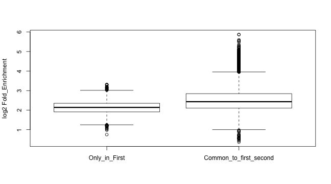

ChIP-seq 
========================================================
author:MRC LMS Bioinformatics Core
date:https://lmsbioinformatics.github.io/LMS_ChIPseq_short
width: 1440
height: 1100
autosize: true
font-import: <link href='http://fonts.googleapis.com/css?family=Slabo+27px' rel='stylesheet' type='text/css'>
font-family: 'Slabo 27px', serif;
css:style.css


ChIP-seq introduction 
========================================================

Chromatin precipitation followed by deep sequencing (**ChIP-seq**) is a well established technique which allows for the genome wide identification of transcription factor binding sites and epigenetic marks. 

<div align="center">

</div>
ChIP-seq introduction (continued)
========================================================
In this course we will use a few of the packages from the comprehensive repository available from the [Bioconductor project](https://www.bioconductor.org/).

We will cover some of the basics of quality control, working with peaks, motif identification and functional analysis. 

For more details on alignment, working with ChIP-seq coverage and peak calling you can join us on [our extended course](https://lmsbioinformatics.github.io/LMS_chipseqcourse).

========================================================

* Where to find more information.
* [ChIP-seq file types covered](#/filetypes).
* [Story so far](#/background).
* [Materials](#/materials).
* [Assessing ChIP-seq quality](#/qc).
* [Working with peaks](#/peakpushing).
* [Functional annotation of peaks](#/functional).
* [Denovo motifs](#/motifs).
* [Getting hold of external data](#/external).
* [Exporting data for visualisation](#/viz).

Some extra work -
* [Complex Overlaps](#/complexOverlaps).
* [Differential ChIP-seq](#/diffchip).

Reminder of file types
========================================================
id: filetypes

In this session we will be dealing with two data types,

* [BED/BED6 files](http://mrccsc.github.io/genomicFormats.html#/18).

* [FASTA files](http://mrccsc.github.io/genomicFormats.html#/6).

Reminder of file types - BED files
========================================================

* BED or BED 6 files are used to store genomic locations. 
* A mimimum requirement is chromosome,start and end positions for intervals.
* BED6 can additionally store interval name, score and strand.


Reminder of file types - FASTA files
========================================================

* FASTA files store sequence information alongside names for stored sequences.
* Lines starting with ">" contains name and/or information on sequence.
* Lines following contain contig sequence


Story so far.
========================================================
id: background

In this course we will use some of the Encode data for Myc ChIP-seq in mouse aligned to the mm9 genome (GEO - GSM912934, GSM912906).

This data is composed of Myc chip for two cell lines, Mel and Ch12 cell lines, each with two replicates.

Due to the short time we have together the data has been processed from unaligned reads to called peaks. 

For full details on the analysis/processing of this data with all analysis steps covered in R/Bioconductor are available on [github](https://lmsbioinformatics.github.io/LMS_chipseqcourse/).

Materials.
========================================================
id: materials

All material for this course can be found on github.
* [ChIPseq_short](https://lmsbioinformatics.github.io/LMS_ChIPseq_short)

Or can be downloaded as a zip archive from here. 
* [Download zip](https://lmsbioinformatics.github.io/LMS_ChIPseq_short/archive/master.zip)

Materials. - Presentations, source code and practicals.
========================================================

Once the zip file in unarchived. All presentations as HTML slides and pages, their R code and HTML practical sheets will be available in the directories underneath.

* **presentations/slides/**
Presentations as an HTML slide show.
* **presentations/singlepage/** 
Presentations as an HTML single page.
* **presentations/rcode/**
R code in presentations.
* **presentations/practicals/**
Practicals as an HTML page. 

Materials. - Data for presentations, practicals.
========================================================

All data to run code in the presentations and in the practicals is available in the zip archive. This includes raw data (MACS peak calls) as well as R objects containing pre-compiled results.

**data/MacsPeaks/**
- MACS peak calls for the 4 Myc ChIP-seq datasets ending in *"_peaks.xls"*
+ 2 replicates of Myc ChIP from Mel cell-line (mycmelrep1,mycmelrep1) 
+ 2 replicates of Myc ChIP from Ch12 cell-line (mycch12rep1,mycch12rep1)

**data/robjects/**
- Robjects for further analysis or review

**data/peaksFromCourse/**
- Contains all GRanges generated in slides exported as a BED file for review in IGV or genome browser of choice.


Set the Working directory
========================================================

Before running any of the code in the practicals or slides we need to set the working directory to the folder we unarchived. 

You may navigate to the unarchived ChIPseq_1Day folder in the Rstudio menu

**Session -> Set Working Directory -> Choose Directory**

or in the console.


```r
setwd("/PathToMyDownload/ChIPseq_1Day/course")
# e.g. setwd("~/Downloads/ChIPseq_1Day/course")
```


Working With ChIP-seq data in R
========================================================
type:section

Quality Control.
========================================================
id: qc

ChIP-seq has many sources of potential noise including 
* Varying efficiency of antibodies
* Non-specific binding
* Library complexity
* ChIP artefacts and background.

Many of these sources of noise can be assessed using some now well-established methodology.

Quality Control. - Some references
========================================================

For some discussions:

* Encode quality metrics.

[Large-scale quality analysis of published ChIP-seq data. Marinov GK, Kundaje A, Park PJ, Wold BJ. G3 (Bethesda). 2014 Feb 19;4(2)](http://www.ncbi.nlm.nih.gov/pmc/articles/PMC3931556/)

* Overestimation of artefact duplicates in ChIPseq.

[Systematic evaluation of factors influencing ChIP-seq fidelity.Nat Methods. Chen Y, Negre N, Li Q, Mieczkowska JO, Slattery M, Liu T, Zhang Y, Kim TK, He HH, Zieba J, Ruan Y, Bickel PJ, Myers RM, Wold BJ, White KP, Lieb JD, Liu XS. 2012 Jun;9(6)](http://www.ncbi.nlm.nih.gov/pmc/articles/PMC3477507/)


* When and what QC is useful.

[Impact of artifact removal on ChIP quality metrics in ChIP-seq and ChIP-exo data.Front Genet. 2014 Apr 10;5:75.Carroll TS, Liang Z, Salama R, Stark R, de Santiago I](http://www.ncbi.nlm.nih.gov/pmc/articles/PMC3989762/)

Quality Control - Always have an appropriate input.
========================================================

* Input samples are typically made from fragmented DNA prior to IP enrichment.

* Allows for control of artefact regions which occur across samples.

* NEVER run ChIP-seq without considering which input to use.

e.g. When using tumour samples for ChIP-seq, it is important to have matched input samples. 
Differing conditions of same tissue may share common input. 

Quality Control - Quality metrics for ChIP-seq.
========================================================

The ChIPQC package wraps some of the metrics into a Bioconductor package and takes care to measure these metrics under the appropriate condition. 

To run a single sample through ChIPQCsample function, we must provide the a set of peaks, the relevant unfiltered BAM file and we are recommended to supply a **blacklist** as a BED file or GRanges and Genome name.

You can find a Blacklist for most genomes at [Anshul Kundaje's site](https://sites.google.com/site/anshulkundaje/projects/blacklists) 


```r
QCresult <- ChIPQCsample(reads="/pathTo/myChIPreads.bam",
                         peaks="/pathTo/myChIPpeaks.bed",
                         genome="mm9",
                         blacklist = "/pathTo/mm9_Blacklist.bed")
```

Quality Control 
========================================================

Although we may not have time in this practical, we can look at the full course to see how to create ChIPQCexperiment objects containing multiple samples' QC metrics.

Here we can import the ChIPQCexperiment object from the course and take a look at some of the outputs. 

The first useful function is QCmetrics which will provide a table of QC scores.


```r
library(ChIPQC)
load("data/robjects/ChIPQCwithPeaks.RData")
QCmetrics(res)
```


|           |    Reads| Map%|   Filt%|  Dup%| ReadL| FragL| RelCC|  SSD| RiP%| RiBL%|
|:----------|--------:|----:|-------:|-----:|-----:|-----:|-----:|----:|----:|-----:|
|myc_ch12_1 | 10792905|  100| 0.0e+00| 10.20|    36|   176| 1.030| 5.22| 14.0|  13.9|
|myc_ch12_2 |  9880785|  100| 0.0e+00|  9.98|    36|   146| 1.370| 3.94| 19.5|  11.1|
|myc_Mel_1  |  9912979|  100| 0.0e+00|  9.70|    35|   169| 1.150| 4.57| 23.1|  13.0|
|myc_Mel_2  | 10475318|  100| 0.0e+00|  9.71|    35|   161| 0.973| 5.54| 21.7|  15.3|
|ch12       | 15907271|  100| 6.3e-06|  6.85|    36|   180| 0.744| 7.76|   NA|  16.2|
|MEL        | 18437914|  100| 0.0e+00|  5.65|    35|   173| 0.444| 8.61|   NA|  17.1|


Quality Control (Fraction of reads in peaks - FRIP/RIP)
========================================================

RIP/FRIP/PTIH/SPOT all are measurements of the fraction/percentage of reads landing in peaks. Variability in the proportion of reads in peaks for ChIP-seq samples can identify poorer quality replicates.


```r
frip(res)
```

```
myc_ch12_1 myc_ch12_2  myc_Mel_1  myc_Mel_2       ch12        MEL 
 0.1400971  0.1949768  0.2309460  0.2172935         NA         NA 
```

```r
plotFrip(res)
```


Quality Control (Assessing fragment length)
========================================================

The prediction of fragment length is an essential part of ChIP-seq affecting peaks calling, summit identification and coverage profiles. 

The use of cross-correlation or cross-coverage allows for an assessment of reads clustering by strand and so a measure of quality. 

Quality Control (Assessing fragment length)
========================================================
<div align="center">

</div>

Quality Control (Assessing fragment length)
========================================================
* In ChIP-seq typically short single end reads of dsDNA.

* **dsDNA single end sequencing means**
+ 5' will be sequenced on "+" strand
+ 3' end will be on "-" strand.

* **Although we only have partial sequence of strand, with predicted fragment length.**
+ "+" reads should extend only in positive direction 
+ "-" reads only in negative

Quality Control (Assessing fragment length)
========================================================
<div align="center">

</div>

Quality Control (Assessing fragment length)
========================================================
<div align="center">

</div>


Quality Control (Assessing fragment length)
========================================================
<div align="center">

</div>
<div align="center">

</div>


Quality Control (Assessing fragment length)
========================================================
<div align="center">

</div>


Quality Control (Assessing fragment length)
========================================================
ChIPQC has already calculated change in coverage between successive shifts of the "+" strand reads towards "-" strand reads and we can plot these for inspection with the **plotCC** function. 


```r
ccplot <- plotCC(res)
ccplot$layers <- ccplot$layers[1]
ccplot
```


Quality Control - Blacklists and SSD.
========================================================

ChIP-seq will often show the presence of common artefacts such as ultra-high signal regions or **Blacklists**. Such regions can confound peak calling, fragment length estimation and QC metrics.

SSD is a measure of standard deviation of signal across the genome with higher scores reflecting significant pile-up of reads. SSD can therefore be used to assess both the extent of ultra high signals and the signal following removal of these blacklisted regions.

For a note on known Blacklisted regions and on associated resources.
* [Blacklisted Regions](http://mrccsc.github.io/analysisbeginings.html#/35)

For a note on SSD
* [SSD and Signal Pileup](http://mrccsc.github.io/analysisbeginings.html#/36).

Quality Control - Blacklist???
========================================================

<div align="center">

</div>


Quality Control - Blacklist affects many metrics.
========================================================

<div align="center">

</div>


Quality Control - Blacklist affects many metrics.
========================================================

<div align="center">

</div>


Quality Control - Standardised Standard Deviation.
========================================================

ChIPQC calculates SSD before and after removing signal coming from Blacklisted regions.

The plotSSD function plots samples's pre-blacklisting score in **red** and post-blacklisting score in **blue**.

Higher scores for pre-blacklisted SSD can suggest a strong background signal in blacklisted regions for that sample.


```r
plotSSD(res)+xlim(0,14)
```


Quality Control - Standardised Standard Deviation.
========================================================

Since SSD score is strongly affected by blacklisting it may be necessary to change the axis to see any differences between samples for post-blacklisting scores.

Higher post-blacklisted SSD scores reflect samples with stronger peak signal.


```r
plotSSD(res)+xlim(0.2,0.4)
```


Quality Control 
========================================================

For more details on assessing ChIP-seq quality you can visit the Bioconductor workshop we ran in Boston (Bioc 2014).

* Practical - https://www.bioconductor.org/help/course-materials/2014/BioC2014/Bioc2014_ChIPQC_Practical.pdf
* Practical Data - https://www.bioconductor.org/help/course-materials/2014/BioC2014/BCell_Examples.RData
* Theory part - https://www.bioconductor.org/help/course-materials/2014/BioC2014/ChIPQC_Presentation.pdf

Working with Peaks
========================================================
id: peakpushing

Macs2 is a frequently used peak caller and works well to identify both punctate and broad peaks.

For more details on peak calling steps for data in this course you can visit our [material](https://lmsbioinformatics.github.io/LMS_chipseqcourse/blob/master/Precticals_pres/peakCallingForMyc).

For more details on MACS2, see the github page for MACS2 software
* [MACS2 github page](https://github.com/taoliu/MACS).

Working with Peaks
========================================================
MACS peak calls can be found in the user specied output directory with the suffix and extension "_peaks.xls".

MACS peaks come as a tab seperated file thinly disguised as a ".xls".


|chr |   start|     end| length| abs_summit| pileup| X.log10.pvalue.| fold_enrichment| X.log10.qvalue.|name               |
|:---|-------:|-------:|------:|----------:|------:|---------------:|---------------:|---------------:|:------------------|
|1   | 4480665| 4480849|    185|    4480769|     12|         6.89435|         4.45956|         4.21774|mycch12rep1_peak_1 |
|1   | 4661593| 4661934|    342|    4661762|     36|        30.49564|        11.09288|        26.75324|mycch12rep1_peak_2 |
|1   | 4774202| 4774393|    192|    4774293|     10|         5.83769|         4.13574|         3.27058|mycch12rep1_peak_3 |

Working with Peaks
========================================================

In addition to the genomic coordinates of peaks, these files contain useful information on the samples, parameters and version used for peak calling at the top.


```
[1] "# Command line: callpeak -t wgEncodeSydhTfbsCh12CmycIggrabRawDataRep1sorted.bam.bam -c wgEncodeSydhTfbsCh12InputIggmusRawDatasorted.bam.bam -f BAM -n mycch12rep1 --nomodel --extsize 165"
[2] "# ARGUMENTS LIST:"                                                                                                                                                                        
[3] "# name = mycch12rep1"                                                                                                                                                                     
[4] "# format = BAM"                                                                                                                                                                           
[5] "# ChIP-seq file = ['wgEncodeSydhTfbsCh12CmycIggrabRawDataRep1sorted.bam.bam']"                                                                                                            
[6] "# control file = ['wgEncodeSydhTfbsCh12InputIggmusRawDatasorted.bam.bam']"                                                                                                                
```


Working with Peaks - Importing peaks
========================================================

We can import peak files therefore using read.delim function. Note we have set *comment.char* argument to **#** to exclude additional information on peak calling parameters stored within the MACS peak file.


```r
peakfile <- "data/MacsPeaks/mycch12rep1_peaks.xls"
macsPeaks_DF <- read.delim(peakfile,comment.char="#")
macsPeaks_DF[1:2,]
```

```
  chr   start     end length abs_summit pileup X.log10.pvalue.
1   1 4480665 4480849    185    4480769     12         6.89435
2   1 4661593 4661934    342    4661762     36        30.49564
  fold_enrichment X.log10.qvalue.               name
1         4.45956         4.21774 mycch12rep1_peak_1
2        11.09288        26.75324 mycch12rep1_peak_2
```

Working with Peaks - Importing peaks
========================================================

Now we have the information in a table we can create a GRanges object.

GRanges objects are made of chromosome names and intervals stored as IRanges.


```r
library(GenomicRanges)
macsPeaks_GR <- GRanges(
 seqnames=macsPeaks_DF[,"chr"],
 IRanges(macsPeaks_DF[,"start"],
         macsPeaks_DF[,"end"]
 )
)
macsPeaks_GR
```

```
GRanges object with 33498 ranges and 0 metadata columns:
          seqnames          ranges strand
             <Rle>       <IRanges>  <Rle>
      [1]        1 4480665-4480849      *
      [2]        1 4661593-4661934      *
      [3]        1 4774202-4774393      *
      [4]        1 4775399-4775792      *
      [5]        1 4775957-4776125      *
      ...      ...             ...    ...
  [33494]        Y   234019-234250      *
  [33495]        Y   307766-308084      *
  [33496]        Y   582005-582258      *
  [33497]        Y   622964-623320      *
  [33498]        Y 2721204-2721372      *
  -------
  seqinfo: 22 sequences from an unspecified genome; no seqlengths
```

Working with Peaks - Peaks as GRanges
========================================================

As we have seen before elements in GRanges can accessed and set using various GRanges functions.
Here we can deconstruct our object back to contig names and interval ranges.


```r
seqnames(macsPeaks_GR)
```

```
factor-Rle of length 33498 with 22 runs
  Lengths: 2257 1766 3226 1299 1509 1171 ... 1906 1571 1860   11  614    5
  Values :    1   10   11   12   13   14 ...    7    8    9   MT    X    Y
Levels(22): 1 10 11 12 13 14 15 16 17 18 19 2 3 4 5 6 7 8 9 MT X Y
```

```r
ranges(macsPeaks_GR)
```

```
IRanges object with 33498 ranges and 0 metadata columns:
              start       end     width
          <integer> <integer> <integer>
      [1]   4480665   4480849       185
      [2]   4661593   4661934       342
      [3]   4774202   4774393       192
      [4]   4775399   4775792       394
      [5]   4775957   4776125       169
      ...       ...       ...       ...
  [33494]    234019    234250       232
  [33495]    307766    308084       319
  [33496]    582005    582258       254
  [33497]    622964    623320       357
  [33498]   2721204   2721372       169
```

Working with Peaks - Peaks as GRanges
========================================================

GRanges objects may have metadata attached. Here we attach some useful information on our peaks including the summit position and the fold enrichment over input.


```r
mcols(macsPeaks_GR) <- macsPeaks_DF[,c("abs_summit", "fold_enrichment")]
macsPeaks_GR
```

```
GRanges object with 33498 ranges and 2 metadata columns:
          seqnames          ranges strand | abs_summit fold_enrichment
             <Rle>       <IRanges>  <Rle> |  <integer>       <numeric>
      [1]        1 4480665-4480849      * |    4480769         4.45956
      [2]        1 4661593-4661934      * |    4661762        11.09288
      [3]        1 4774202-4774393      * |    4774293         4.13574
      [4]        1 4775399-4775792      * |    4775544         7.31683
      [5]        1 4775957-4776125      * |    4776021         3.17407
      ...      ...             ...    ... .        ...             ...
  [33494]        Y   234019-234250      * |     234139         5.10991
  [33495]        Y   307766-308084      * |     307929        18.80093
  [33496]        Y   582005-582258      * |     582128         5.08412
  [33497]        Y   622964-623320      * |     623149         7.89867
  [33498]        Y 2721204-2721372      * |    2721341         6.14918
  -------
  seqinfo: 22 sequences from an unspecified genome; no seqlengths
```


Working with Peaks - GRanges manipulation.
========================================================

GRanges objects can be rows subset as vectors or data.frames/matrices using an index.

In this example, the first 3 genomic intervals are retrieved.


```r
macsPeaks_GR[1:3]
```

```
GRanges object with 3 ranges and 2 metadata columns:
      seqnames          ranges strand | abs_summit fold_enrichment
         <Rle>       <IRanges>  <Rle> |  <integer>       <numeric>
  [1]        1 4480665-4480849      * |    4480769         4.45956
  [2]        1 4661593-4661934      * |    4661762        11.09288
  [3]        1 4774202-4774393      * |    4774293         4.13574
  -------
  seqinfo: 22 sequences from an unspecified genome; no seqlengths
```

```r
# or macsPeaks_GR[1:3,]
```

Working with Peaks - GRanges manipulation.
========================================================

GRanges objects can also be rows subset as vectors or data.frames/matrices using logical vectors.

Here we can retrieve all peaks on chromosome 1.


```r
macsPeaks_GR[seqnames(macsPeaks_GR) %in% "1"]
```

```
GRanges object with 2257 ranges and 2 metadata columns:
         seqnames              ranges strand | abs_summit fold_enrichment
            <Rle>           <IRanges>  <Rle> |  <integer>       <numeric>
     [1]        1     4480665-4480849      * |    4480769         4.45956
     [2]        1     4661593-4661934      * |    4661762        11.09288
     [3]        1     4774202-4774393      * |    4774293         4.13574
     [4]        1     4775399-4775792      * |    4775544         7.31683
     [5]        1     4775957-4776125      * |    4776021         3.17407
     ...      ...                 ...    ... .        ...             ...
  [2253]        1 196603937-196604107      * |  196604025          4.6006
  [2254]        1 196643096-196643377      * |  196643232        14.81234
  [2255]        1 196706013-196706236      * |  196706154          5.0807
  [2256]        1 196956950-196957403      * |  196957192         5.11378
  [2257]        1 196957597-196957944      * |  196957689          3.9841
  -------
  seqinfo: 22 sequences from an unspecified genome; no seqlengths
```

Working with Peaks - GRanges naming and indexing
========================================================

GRanges objects may have names attached to each genomic interval as seen with vector elements.

This name may also be used to retrieve an interval of interest.


```r
names(macsPeaks_GR) <- macsPeaks_DF[,"name"]
macsPeaks_GR["mycch12rep1_peak_33496"]
```

```
GRanges object with 1 range and 2 metadata columns:
                         seqnames        ranges strand | abs_summit
                            <Rle>     <IRanges>  <Rle> |  <integer>
  mycch12rep1_peak_33496        Y 582005-582258      * |     582128
                         fold_enrichment
                               <numeric>
  mycch12rep1_peak_33496         5.08412
  -------
  seqinfo: 22 sequences from an unspecified genome; no seqlengths
```


Working with peaks - Read in peaksets in one step.
========================================================

There are many helper functions for reading in peak sets.

The **rtracklayer** package has many tools for importing common file formats with the *import.bed* function being useful for peak sets in bed formats.

Since MACS has a slightly different format to BED or BED6 we can use a **ChIPQC** function *GetGRanges* to read here.


```r
peakfile <- "data/MacsPeaks/mycch12rep1_peaks.xls"
singlePeakSet <- ChIPQC:::GetGRanges(peakfile, sep="\t", simple=F)
singlePeakSet[1:2,]
```

```
GRanges object with 2 ranges and 7 metadata columns:
      seqnames          ranges strand |        ID     Score   Strand
         <Rle>       <IRanges>  <Rle> | <integer> <integer> <factor>
  [1]        1 4480665-4480849      * |       185   4480769        *
  [2]        1 4661593-4661934      * |       342   4661762        *
      X.log10.pvalue. fold_enrichment X.log10.qvalue.               name
            <numeric>       <numeric>       <numeric>           <factor>
  [1]         6.89435         4.45956         4.21774 mycch12rep1_peak_1
  [2]        30.49564        11.09288        26.75324 mycch12rep1_peak_2
  -------
  seqinfo: 22 sequences from an unspecified genome; no seqlengths
```


Manipulating Peak Sets - Finding Common peaks
=========================================================

Now we have our data in peak format we can start to do some simple but powerful analysis.

First lets read in the two replicate Myc ChIP replicates for Ch12 cell.


```r
firstPeakSet <- ChIPQC:::GetGRanges("data/MacsPeaks//mycch12rep1_peaks.xls", sep="\t", simple=F)
secondPeakSet <- ChIPQC:::GetGRanges("data/MacsPeaks//mycch12rep2_peaks.xls", sep="\t", simple=F)
```
Manipulating Peak Sets - Finding Common peaks
=========================================================

We have learnt how to identify overlapping intervals in the Bioconductor tutorial using the [%over%](?%over%) command.

Here we can apply this to identifying peaks in both replicates.


```r
OnlyfirstPeakSet <- firstPeakSet[!firstPeakSet %over% secondPeakSet]
firstANDsecondPeakSets <- firstPeakSet[firstPeakSet %over% secondPeakSet]
length(OnlyfirstPeakSet)
```

```
[1] 4697
```

```r
length(firstANDsecondPeakSets)
```

```
[1] 28801
```

Manipulating Peak Sets - Accessing data in GRanges metadata columns
=========================================================

Data in GRanges metadata columns may be accessed just as data.frame columns.

To access the fold_enrichment or abs_summit columns we can use the following syntax


```r
foldEnrichment <- firstPeakSet$fold_enrichment
# or foldEnrichment <- firstPeakSet[,"fold_enrichment"]
foldEnrichment[1:10]
```

```
 [1]  4.45956 11.09288  4.13574  7.31683  3.17407  3.73551  5.86629
 [8]  4.86149  6.01562  5.39653
```

Manipulating Peak Sets - Finding Common peaks
=========================================================

Now can plot the distribution of peaks' signal over input for those common to both replicates and those unique to replicate 1.

Here it is clear that the peaks with the highest fold enrichment are common to both replicates.


```r
FirstOnly_FE <- log2(OnlyfirstPeakSet$fold_enrichment)
FirstAndSecond_FE <- log2(firstANDsecondPeakSets$fold_enrichment)

boxplot(FirstOnly_FE,
        FirstAndSecond_FE,
        names=c("Only_in_First","Common_to_first_second"),
        ylab="log2 Fold_Enrichment")
```



Manipulating Peak Sets - Finding Common peaks
=========================================================

When looking at peaks which occur in both samples it is clear that the number of peaks in first replicate overlapping those in second is different from number of second replicate peaks overlapping first.

This is because 2 peaks from one replicate may overlap 1 peak in the other replicate.


```r
firstANDsecondPeakSets <- firstPeakSet[firstPeakSet %over% secondPeakSet]
secondANDfirstPeakSets <- secondPeakSet[secondPeakSet %over% firstPeakSet]

length(firstANDsecondPeakSets)
```

```
[1] 28801
```

```r
length(secondANDfirstPeakSets)
```

```
[1] 27858
```

=========================================================


Manipulating Peak Sets - Finding Common peaks
=========================================================

A common step with finding overlapping transcription factor peaks is to reduce peaksets to single non-overlapping peakset before interrogating whether a peak occurred in a sample.

This allows for a single peak set to be used as a consensus peakset between replicates.


```r
allPeaks <- c(firstPeakSet,secondPeakSet)
allPeaksReduced <- reduce(allPeaks)
length(allPeaks)
```

```
[1] 84856
```

```r
length(allPeaksReduced)
```

```
[1] 55427
```

=========================================================


=========================================================
id: makingcommonpeaks

Now we can use a logical expression to subset our reduced/flattened peak set to those overlapping peaks in both the first and second replicate.


```r
commonPeaks <- allPeaksReduced[allPeaksReduced %over% firstPeakSet 
                               & allPeaksReduced %over% secondPeakSet]
length(commonPeaks)
```

```
[1] 27232
```

=========================================================


Time for a exercise.
=========================================================

Exercise on "Working with peaks" can be found [here](https://lmsbioinformatics.github.io/LMS_ChIPseq_short/blob/master/course/presentations/practicals/WorkingWithPeaks_Exercises.html).

Time for a solution.
=========================================================

Answers on "Working with peaks" can be found [here](https://lmsbioinformatics.github.io/LMS_ChIPseq_short/blob/master/course/presentations/practicals/WorkingWithPeaks_Solutions.html).

Rcode for "Working with peaks" solutions can be found [here](https://lmsbioinformatics.github.io/LMS_ChIPseq_short/blob/master/course/presentations/practicals/WorkingWithPeaks.R).


Time to install a package.
=========================================================

In this next section we will be using a package ,**rGREAT**, which has not been pre-installed on these machines.

We saw how to install packages in R and Bioconductor sessions.

You can go to the [rGREAT Bioconductor page](https://www.bioconductor.org/packages/release/bioc/html/rGREAT.html) and follow their instrutions or simply paste the below code into the console.


```r
if (!requireNamespace("BiocManager", quietly = TRUE))
    install.packages("BiocManager")

BiocManager::install("rGREAT")
```


Functional Annotation of peaks
=========================================================
id: functional

So far we have been working with ChIP-seq peaks corresponding to transcription factor binding. Transcription factors, as implied in the name, can affect the expression of their target genes.

The target of transcription factor is hard to assertain from ChIP-seq data alone and so often we will annotate peaks to genes by a simple set of rules:-

Peaks are typically annotated to a gene if
* They overlap the gene.
* The gene is the closest (and within a minimum distance.)


Peak annotation
=========================================================

A useful package for annotation of peaks to genes is **ChIPseeker**. 

By using pre-defined annotation in the from of a **TXDB** object for mouse (mm9 genome), ChIPseeker will provide us with an overview of where peaks land in the gene and distance to TSS sites.

First load the libraries we require for the next part.


```r
library(TxDb.Mmusculus.UCSC.mm9.knownGene)
library(org.Mm.eg.db)
library(GenomeInfoDb)
library(ChIPseeker)
```

Peak annotation
=========================================================

We use **GenomeInfoDb** package to fix chromosome naming style. We know we are using UCSC annotation (TxDb.Mmusculus.UCSC.mm9.knownGene) so we can style our previously defined [commonPeaks](#/makingcommonpeaks) to "UCSC" standard using the *seqlevelsStyle* function.


```r
commonPeaks[1:2, ]
```

```
GRanges object with 2 ranges and 0 metadata columns:
      seqnames          ranges strand
         <Rle>       <IRanges>  <Rle>
  [1]        1 4661367-4661934      *
  [2]        1 4775386-4776125      *
  -------
  seqinfo: 22 sequences from an unspecified genome; no seqlengths
```

```r
seqlevelsStyle(commonPeaks) <- "UCSC"
commonPeaks[1:2, ]
```

```
GRanges object with 2 ranges and 0 metadata columns:
      seqnames          ranges strand
         <Rle>       <IRanges>  <Rle>
  [1]     chr1 4661367-4661934      *
  [2]     chr1 4775386-4776125      *
  -------
  seqinfo: 22 sequences from an unspecified genome; no seqlengths
```

Peak annotation
=========================================================

The annotatePeak function accepts a GRanges object of the regions to annotate, a TXDB object for gene locations and a database object name to retrieve gene names from.


```r
peakAnno <- annotatePeak(commonPeaks, tssRegion = c(-1000, 1000), TxDb = TxDb.Mmusculus.UCSC.mm9.knownGene, 
    annoDb = "org.Mm.eg.db")
```

```
>> preparing features information...		 2019-09-20 15:35:17 
>> identifying nearest features...		 2019-09-20 15:35:18 
>> calculating distance from peak to TSS...	 2019-09-20 15:35:19 
>> assigning genomic annotation...		 2019-09-20 15:35:19 
>> adding gene annotation...			 2019-09-20 15:35:32 
>> assigning chromosome lengths			 2019-09-20 15:35:33 
>> done...					 2019-09-20 15:35:33 
```

Peak annotation
=========================================================

The result is a csAnno object containing annotation for peaks and overall annotation statistics.


```r
class(peakAnno)
```

```
[1] "csAnno"
attr(,"package")
[1] "ChIPseeker"
```

```r
peakAnno
```

```
Annotated peaks generated by ChIPseeker
27227/27232  peaks were annotated
Genomic Annotation Summary:
             Feature  Frequency
9           Promoter 29.4303449
4             5' UTR  0.5178683
3             3' UTR  1.7152092
1           1st Exon  0.5252139
7         Other Exon  3.1476108
2         1st Intron 12.5573879
8       Other Intron 19.7744886
6 Downstream (<=300)  1.5242223
5  Distal Intergenic 30.8076542
```


Peak annotation
=========================================================

The csAnno object contains the information on annotation of individual peaks to genes.

To extract this from the csAnno object the ChIPseeker functions *as.GRanges* or *as.data.frame* can be used to produce the respective object with peaks and their associated genes.


```r
peakAnno_GR <- as.GRanges(peakAnno)
peakAnno_GR[1:3, ]
```

```
GRanges object with 3 ranges and 12 metadata columns:
      seqnames          ranges strand |        annotation   geneChr
         <Rle>       <IRanges>  <Rle> |       <character> <integer>
  [1]     chr1 4661367-4661934      * | Distal Intergenic         1
  [2]     chr1 4775386-4776125      * |          Promoter         1
  [3]     chr1 4847417-4848050      * |          Promoter         1
      geneStart   geneEnd geneLength geneStrand      geneId transcriptId
      <integer> <integer>  <integer>  <integer> <character>  <character>
  [1]   4763279   4775807      12529          2       27395   uc007afd.2
  [2]   4763279   4775807      12529          2       27395   uc007afd.2
  [3]   4847775   4887990      40216          1       21399   uc007afi.2
      distanceToTSS            ENSEMBL      SYMBOL
          <numeric>        <character> <character>
  [1]        113873 ENSMUSG00000033845      Mrpl15
  [2]             0 ENSMUSG00000033845      Mrpl15
  [3]             0 ENSMUSG00000033813       Tcea1
                                       GENENAME
                                    <character>
  [1]       mitochondrial ribosomal protein L15
  [2]       mitochondrial ribosomal protein L15
  [3] transcription elongation factor A (SII) 1
  -------
  seqinfo: 22 sequences (1 circular) from mm9 genome
```


Visualising peak annotation
=========================================================
Now we have the annotated peaks from ChIPseeker we can use some of ChIPseeker's plotting functions to display distribution of peaks in gene features. Here we use the **plotAnnoBar** function to plot this as a bar chart but  **plotAnnoPie** would produce a similar plot as a pie chart.


```r
plotAnnoBar(peakAnno)
```


Visualising peak annotation
=========================================================
Similarly we can plot the distribution of peaks around TSS sites.


```r
plotDistToTSS(peakAnno)
```


Visualising peak annotation
=========================================================
ChIPseeker can also offer a succinct plot to describe the overlap between annotations.


```r
upsetplot(peakAnno, vennpie = F)
```


Gene Ontology and geneset testing.
=========================================================
id:gsa

Transcription factors or epigenetic marks may act on specific sets of genes grouped by a common biological feature (shared Biological function, common regulation in RNAseq experiment etc).

A frequent step in ChIP-seq analysis is to test whether common gene sets are enriched for transcription factor binding or epigenetic marks.

Sources of well curated genesets include [GO consortium](http://geneontology.org/) (gene's function, biological process and cellular localisation), [REACTOME](http://www.reactome.org/) (Biological Pathways) and [MsigDB](http://software.broadinstitute.org/gsea/msigdb/) (Computationally and Experimentally derived).

Geneset enrichment testing may be performed on the sets of genes with peaks associated to them. In this example we will consider genes with peaks within 1000bp of a gene's TSS. 


Gene ontology and geneset testing.
=========================================================

To perform geneset testing here, we will use the GOseq package and so must provide a named numeric vector of 1s or 0s to illustrate whether a gene had any peaks overlapping it's TSS.

In this example we use all TSS sites we found to be overlapped by our common peaks we [previously defined](#/makingcommonpeaks). So first lets find all peaks overlapping TSS regions.

The peaks landing in TSS regions will be marked as "Promoter" in the **annotation** column of our annotated GRanges object. We can extract the unique names of genes with peaks in their TSS by subsetting the annotated GRanges and retrieving gene names from the **geneId** column.


```r
genesWithPeakInTSS <- unique(peakAnno_GR[peakAnno_GR$annotation == "Promoter", 
    ]$geneId)

genesWithPeakInTSS[1:2]
```

```
[1] "27395" "21399"
```

Gene ontology and functional testing.
=========================================================

Next we can extract all genes which are included in the TxDb object to use as our universe of genes for pathway enrichment.


```r
allGenes <- unique(unlist(keys(TxDb.Mmusculus.UCSC.mm9.knownGene, "GENEID")))

length(allGenes)
```

```
[1] 21761
```

Gene ontology and functional testing.
=========================================================

Once we have a vector of all genes we can create a named vector of 1s or 0s representing whether a gene had peak in TSS or not.


```r
allGenesForGOseq <- as.integer(allGenes %in% genesWithPeakInTSS)
names(allGenesForGOseq) <- allGenes
allGenesForGOseq[1:3]
```

```
100009600 100009609 100009614 
        0         0         0 
```


Gene ontology and functional testing.
=========================================================

A little helper function you may recognise to add some useful KEGG names alongside the KEGG pathway IDs in GOseq results.


```r
library(KEGG.db)
library(goseq)
xx <- as.list(KEGGPATHID2NAME)
temp <- cbind(names(xx),unlist(xx))
addKeggTogoseq <- function(JX,temp){
  for(l in 1:nrow(JX)){
    if(JX[l,1] %in% temp[,1]){
      JX[l,"term"] <- temp[temp[,1] %in% JX[l,1],2]
      JX[l,"ontology"] <- "KEGG"
    }
    
  }
  return(JX)
}
```

Gene ontology and functional testing.
=========================================================

Now we have the the input for GOseq we can test against KEGG (or GO if we choose) using a standard hypergeometric test.


```r
library(goseq)

pwf = nullp(allGenesForGOseq, "mm9", "knownGene", plot.fit = FALSE)

Kegg_MycPeaks <- goseq(pwf, "mm9", "knownGene", test.cats = c("KEGG"), method = "Hypergeometric")

Kegg_MycPeaks <- addKeggTogoseq(Kegg_MycPeaks, temp)

Kegg_MycPeaks[1:4, ]
```

```
    category over_represented_pvalue under_represented_pvalue numDEInCat
90     03013            1.545710e-21                        1        111
96     03040            3.056583e-19                        1         91
89     03010            3.284752e-19                        1         70
112    04110            3.758630e-15                        1         84
    numInCat          term ontology
90       157 RNA transport     KEGG
96       125   Spliceosome     KEGG
89        87      Ribosome     KEGG
112      123    Cell cycle     KEGG
```


Gene ontology and functional testing. GREAT method.
=========================================================

In addition to a standard enrichment tests, methods have been implemented specifically for ChIP-seq. Many of these tools aim to incorporate peaks distal to genes into their enrichment testing such as the popular [GREAT](http://bejerano.stanford.edu/great/public/html/splash.php) toolset.

Incorporating distal peaks by rules such as nearest gene results in some genes having a higher chance of being selected and hence some genesets as a whole having a higher chance of having its members selected.

[GREAT](http://bejerano.stanford.edu/great/public/html/splash.php) defines regulatory regions for each, individual gene and compares the proportion of peaks mapping to a geneset's regulatory regions to the proportion of the genome occupied by geneset's regulatory regions.

i.e. If a gene set's regulatory regions account for 1% of the genome then one might expect 1% of peaks to overlap these regions by chance.

rGREAT - R interface to GREAT server.
=========================================================

We can use the GREAT Bioconductor interface available in the rGREAT package. Since GREAT uses UCSC annotation lets make sure our peaks our in UCSC style.


```
Error in library(rGREAT) : there is no package called 'rGREAT'
```
